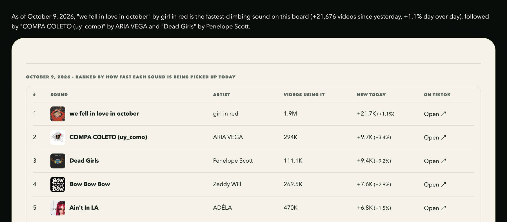
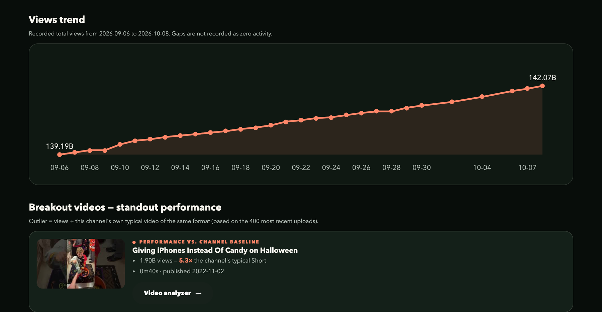
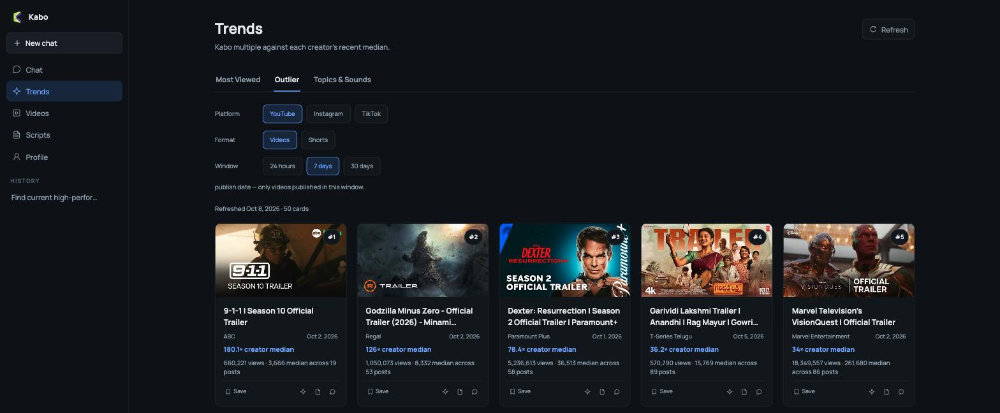

# Kabo — creator research skills for Claude Code and Codex

<p align="center">
  
</p>

<p>
  <a href="https://kabo.sh/?utm_source=github&utm_medium=referral&utm_campaign=202610_plugins_readme&utm_content=readme_links_website">Website</a> ·
  <a href="#quick-start">Install</a> ·
  <a href="https://kabo.sh/tools?utm_source=github&utm_medium=referral&utm_campaign=202610_plugins_readme&utm_content=readme_links_tools">Free creator tools</a> ·
  <a href="https://github.com/kabo-sh/kabo-plugins/issues">Report an issue</a>
</p>

<p>
  <a href="https://github.com/kabo-sh/kabo-plugins/releases"></a>
  <a href="LICENSE"></a>
  <a href="#supported-hosts"></a>
  <a href="#quick-start"></a>
</p>

Kabo is an AI partner for creators. This repository installs the [Kabo](https://kabo.sh/?utm_source=github&utm_medium=referral&utm_campaign=202610_plugins_readme&utm_content=readme_hero) plugin into Claude Code or Codex: ask a question in plain language and get a report built from public channel, account, and video data, with sources, dates, and limits stated.

**Free to use.** Every Kabo account gets a free daily allowance.

## See it in action

<table>
<tr>
<td width="50%" valign="top">
<br/>
<sub><b>The daily TikTok sound board</b> — the board Kabo's TikTok trend research reads: how many videos use each sound and how many were added today. <i>Captured from kabo.sh on 2026-10-09.</i></sub>
</td>
<td width="50%" valign="top">
<br/>
<sub><b>Breakouts against the channel's own baseline</b> — a recorded views trend, and videos ranked by how far they beat the channel's typical video of the same format. <i>Captured from kabo.sh/creators on 2026-10-09.</i></sub>
</td>
</tr>
<tr>
<td colspan="2" valign="top">
<br/>
<sub><b>Outliers in the Kabo workspace</b> — each video's views as a multiple of its creator's recent median, filterable by platform, format, and time window. Kabo runs in the browser too; this plugin brings its research into Claude Code and Codex. <i>Captured from the Kabo web workspace on 2026-10-09.</i></sub>
</td>
</tr>
</table>

## What you can do

| Job | What Kabo does | Platforms |
|---|---|---|
| **Spot what's working now** | Scans current trends and the patterns behind high performers; reads the daily Instagram and TikTok trending-audio boards (usage counts, daily growth, fastest risers) and TikTok's rising search terms; surfaces emerging creators | YouTube · Instagram · TikTok |
| **Study competitors** | Finds comparable accounts, compares their recent content against each account's own baseline, and names positioning gaps | YouTube · Instagram · TikTok |
| **Review an account** | What works, what hurts, and what to continue, stop, or test; engagement rate; follower loss. Ask for a **deep review** and Kabo also watches the account's videos — frames and transcript — at every step | YouTube · Instagram · TikTok |
| **Diagnose a reach drop** | Works out whether a drop, stall, or audience mismatch is real and where it comes from | YouTube · Instagram · TikTok |
| **Break down a video** | Timestamped diagnosis of the hook, pacing, and retention risk — for your video, someone else's, or an unpublished cut on your machine — plus how it was edited | Any public video link or local file |
| **Decide what to make next** | Content ideas from your account, trends, competitors, and comments, then scripts, hooks, and titles for the one you pick | YouTube · Instagram · TikTok |
| **Plan when to post** | A four-week content calendar (CSV/ICS export) and posting times drawn from your own history — never a generic "best time" chart | YouTube · Instagram · TikTok |
| **Build your brand** | Channel names, bios, and usernames within each platform's limits, a profile visual spec, and a media kit for brand outreach | YouTube · Instagram · TikTok |
| **Make money** | Eligibility and threshold gaps for each platform's monetization programs; line-item pricing and a negotiation reply for a brand-deal brief | YouTube · Instagram · TikTok |
| **Check a platform rule** | Verifies rules, thresholds, features, and rumours against official help pages, with quotes, links, and retrieval dates | YouTube · Instagram · TikTok |

New here? Run `/kabo-start`: a short questionnaire, one real analysis of your own account, a 90-day plan, and your first piece of content.

### Example requests

```text
/kabo-analyze why has https://youtube.com/@channel been growing lately?
/kabo-analyze which TikTok sounds are rising fastest today?
/kabo-analyze break down the hook of this Reel: <public link>
/kabo-analyze find TikTok accounts in my niche I should study
/kabo-analyze do a deep review of @handle on Instagram — watch the videos
/kabo-analyze my Instagram reach dropped this month — what changed?
/kabo-analyze how far is my channel from YouTube monetization?
/kabo-analyze what should I charge for this sponsorship brief? <paste brief>
```

## How it works

1. **You ask in plain language.** Kabo picks the matching research skill and shows it to you before anything runs.
2. **Kabo fetches the public data.** Data is collected on Kabo's servers, so there are no API keys to set up. Every skill is signed by the platform and verified on your machine before it executes.
3. **You get a report with its evidence.** Findings come with source links, the time window, the sample size, and what could not be measured.

What Kabo does not do:

- **It does not publish for you.** It analyzes, plans, and drafts; posting stays with you.
- **It does not guess private metrics.** Click-through rate, retention, revenue, and Insights are never inferred from public views or likes.
- **It does not promise virality.** When the evidence is thin, the report says so.

## How Kabo compares

We make Kabo, so read this as our view. Every cell comes from each product's own public pages, checked on 2026-10-09. If something has changed, please [open an issue](https://github.com/kabo-sh/kabo-plugins/issues).

| | Kabo | [vidIQ](https://vidiq.com/mcp/) | [TubeBuddy](https://www.tubebuddy.com/pricing) |
|---|---|---|---|
| Where you use it | Inside Claude Code and Codex, or in the browser | Web app, plus an MCP server for Claude, Claude Code, ChatGPT, Cursor, and Codex | Browser extension for YouTube |
| Platforms | YouTube, Instagram, TikTok | YouTube first, with some Instagram and TikTok tools | YouTube |
| Your private analytics (CTR, retention) | Not used: public data only | Yes, for your connected YouTube channel | Yes, for your connected YouTube channel |
| Changes your channel | No: it never publishes or edits | No: its MCP server is read-only | Yes: bulk editing and scheduled publishing (Legend plan and up) |
| Makes thumbnails or clips | No: it drafts ideas, scripts, hooks, and titles | Yes | Thumbnail generator |
| Free tier | Free daily allowance | Free plan with 150 AI credits a month | Free plan |

Pick vidIQ or TubeBuddy if you mostly need your own YouTube channel's private analytics, or tools that make media and edit your channel for you. Pick Kabo if you want research across YouTube, Instagram, and TikTok from public data, delivered as reports that show their sources, time window, and sample size, inside the coding agent you already use.

## Quick start

```bash
curl -fsSL https://raw.githubusercontent.com/kabo-sh/kabo-plugins/main/install.sh | bash
```

The installer finds Claude Code and/or Codex on your machine, installs the plugin, and offers to sign you in to Kabo right away. Then start a new session and run `/kabo-start`.

### Supported hosts

| Host | Status | Requirement | Install by hand | Sign in |
|---|:---:|---|---|---|
| [Claude Code](https://code.claude.com/docs/en/overview) | ✅ Supported | 2.1.195 or newer | `claude plugin marketplace add kabo-sh/kabo-plugins` | `/kabo-login` |
| [Codex](https://github.com/openai/codex) | ✅ Supported | A build with the `codex plugin` command, plus Node.js 20+ | `codex plugin marketplace add kabo-sh/kabo-plugins` | `codex mcp login kabo` |

The one-line installer above covers both hosts. The full manual steps, including the Claude Code `enable` step and the Codex hook trust step, are under [Installation details](#installation-details).

You also need **a Kabo account**. If you don't have one, continuing with Google during sign-in creates it.

Prefer to read the script first? Run it with `--dry-run`, or follow the manual steps under [Installation details](#installation-details).

## Privacy

Creator research data is fetched by Kabo's servers. Usage telemetry is limited to event-level metadata — which skill ran and whether it succeeded; no prompt, tool, or skill-output content is collected. On Claude Code, the sign-in credential is stored only in `~/.kabo/credentials.json` (mode `0600`) and can be removed with `/kabo-logout`. Details are in [Signing in](#signing-in).

## More from Kabo

- **[Free creator tools](https://kabo.sh/tools?utm_source=github&utm_medium=referral&utm_campaign=202610_plugins_readme&utm_content=readme_tools)** — calculators, checkers, and generators for YouTube, Instagram, and TikTok. No account needed.
- **[Kabo in the browser](https://kabo.sh/?utm_source=github&utm_medium=referral&utm_campaign=202610_plugins_readme&utm_content=readme_web)** — the same research and drafting without a coding agent.
- **Kabo for iPhone and Android** — pre-publish video feedback.

---

## Installation details

One command, either host:

```bash
curl -fsSL https://raw.githubusercontent.com/kabo-sh/kabo-plugins/main/install.sh | bash
```

It reports which hosts it found on this machine and lets you pick **one or both** — Claude Code and Codex install in the same run. It never installs a host for you, never uses `sudo`, and never reads or writes a credential. After installing the Claude plugin it offers to start the plugin's own terminal sign-in (`kabo-auth login`, the same RFC 8628 device flow `/kabo-login` runs) right there: say yes, confirm the code, and it immediately makes one real request to the MCP endpoint with the credential just written — so you learn whether it works there and then, rather than at the first 401 inside a session. Say yes if you can: signing in before the first session is the one order in which no session ever shows `kabo` as "needs authentication" — a session that starts before the sign-in cannot pick the credential up and has to be replaced by a new one afterwards (see "Signing in"). Decline, and signing in stays a separate step it prints at the end. It also looks for a pre-plugin direct `claude mcp add kabo` registration of the same endpoint — a leftover that now duplicates the bundled server — and offers to remove it, never automatically. On the Codex side it offers the host's browser OAuth in the same run.

If you would rather not pipe a script into a shell unseen:

```bash
curl -fsSL https://raw.githubusercontent.com/kabo-sh/kabo-plugins/main/install.sh | bash -s -- --dry-run
curl -fsSL https://raw.githubusercontent.com/kabo-sh/kabo-plugins/main/install.sh | bash -s -- --client claude,codex
```

Already cloned this repo? Skip the network: `./install.sh --repo /path/to/kabo-plugins`.

### Upgrading, or repairing a broken install

Run the same one-line command again. For Claude Code, it refreshes the marketplace clone and runs `claude plugin update`, and if the host answers `Plugin "kabo-alpha" not found` — the plugin is installed but the marketplace it came from can no longer be resolved — it re-registers the marketplace from GitHub and reinstalls the plugin. Your Claude sign-in is kept: the credential lives under `~/.kabo`, which the installer never touches.

For an existing Git marketplace that follows this repository's `main`, the manual update commands are:

```bash
# Claude Code
claude plugin marketplace update kabo-plugins
claude plugin update kabo-alpha@kabo-plugins --scope user

# Codex
codex plugin marketplace upgrade kabo-plugins-codex --json
codex plugin add kabo-alpha@kabo-plugins-codex --json
```

Run only the pair for the host you use, and stop if the marketplace refresh fails: updating against a stale snapshot can report the old version as the latest. Restart that host, start a new session, then run `claude plugin list --json` or `codex plugin list --json` and confirm that `kabo-alpha` has the intended version and `enabled: true`. A successful command alone is not proof of an upgrade.

The Claude command above explicitly targets the `user` installation with `--scope user`. Without that flag, versions before 2.1.281 default to `user`; newer versions select the most specific installed scope for the current project ([scope selection](https://code.claude.com/docs/en/plugins/cli-reference#which-scope-the-command-updates)). For a `project` or `local` installation, run it from the relevant project with `--scope project` or `--scope local`, matching the installation shown by `claude plugin list --json`. For a `managed` installation, follow your organization's administrator-managed update policy.

A marketplace pinned to a tag or commit stays pinned when refreshed; inspect that source before deciding to move it to `main`. For a local-path marketplace, its maintainer must first update the local checkout while preserving local changes; a Git marketplace refresh does not update that directory. Do not remove/re-add a marketplace, clear Skill caches, or sign out as a routine upgrade step.

Registry Skill updates are separate from Plugin updates. If your installed Plugin already meets the requested Skill's minimum version, a Registry catalog change alone does not require reinstalling the Plugin. First-time installation instructions follow.

### Claude Code

**Requires Claude Code 2.1.195 or newer.** The bundled MCP server supplies its own credential through a `headersHelper`, and `${CLAUDE_PLUGIN_ROOT}` inside that setting is only interpolated from 2.1.195 on. An older host runs the literal path, the helper never starts, and every request fails with a 401. The host then falls back to its own OAuth discovery, which can even complete — but what it leaves behind is a host-held token that this plugin's sign-in, logout, and telemetry model does not manage. The supported path is the `/kabo-login` device flow, and that needs 2.1.195. Upgrade before installing.

```bash
claude plugin marketplace add kabo-sh/kabo-plugins
claude plugin install kabo-alpha@kabo-plugins
claude plugin enable kabo-alpha
```

The `enable` step is not optional: `claude plugin install` leaves the plugin **disabled by default**, and a disabled plugin looks exactly like one that installed cleanly and does nothing.

Inside a session, `/plugin marketplace add kabo-sh/kabo-plugins` does the same thing as the first line.

### Codex

Requires Node.js 20 or later, and a Codex build that has the `codex plugin` subcommand (`codex plugin --help` answers). If that subcommand is missing, the host has no plugin install surface at all.

```bash
codex plugin marketplace add kabo-sh/kabo-plugins
codex plugin add kabo-alpha@kabo-plugins-codex
```

Two things differ from the Claude side, and neither is cosmetic:

- **The marketplace name is `kabo-plugins-codex`, not `kabo-plugins`.** The two hosts read two different manifests (`.agents/plugins/marketplace.json` and `.claude-plugin/marketplace.json`), so the names have to be distinct even though both publish the same plugin name, `kabo-alpha`.
- **There is no `enable` step, but there is a trust step.** Installing a plugin does not trust its hooks. Review [`plugins/codex/kabo-alpha/hooks/hooks.json`](plugins/codex/kabo-alpha/hooks/hooks.json) and the `scripts/hooks/` files it invokes — they are what reports usage — then trust them explicitly in the host and restart Codex.

### From a local clone

Either host takes a path in place of the slug:

```bash
claude plugin marketplace add /absolute/path/to/kabo-plugins
codex plugin marketplace add /absolute/path/to/kabo-plugins
```


## Signing in

However you installed it, authorization is a separate step, and the two hosts do it differently.

**Claude Code.** The shortest path is the installer itself: it offers to start the sign-in right after installing, so the whole onboarding is install → confirm the code → start a session — done. Otherwise, open a session and run `/kabo-login`: the terminal prints a URL and an 8-character code, and confirming that code in a browser tab — **on any device** — completes an RFC 8628 device flow. Then start a new session: the one you signed in from connected to Kabo before the credential existed and will not pick it up — the host asks the plugin for the credential once, when it connects the server, and does not ask again in that session. If that old session shows the host's own "Authenticate" prompt for `kabo`, ignore it; the plugin's sign-in is the only supported path, and a host-held token is one `/kabo-logout` cannot revoke.

**Your first session.** A successful `/kabo-login` hands off to `/kabo-start`: a short questionnaire, one real analysis of your own account, and a 90-day plan. Run `/kabo-start` again whenever you like — it reads what is already on file and offers to pick up where you stopped or start over.

**Which skills you receive.** `/kabo-channel` (`$kabo-channel` on Codex) shows the Skill Registry channel your account is on. Every account can select Production; an account the platform has granted Internal access can select either and defaults to Internal. Switching channels does not sign you in again and does not change the grant — the server is the sole authority on who has one.

Signing in from inside a running session works too. If Kabo is still unavailable afterwards, **start a new session** — that path works on every host (terminal, IDE extension, desktop app), and on the desktop app it is the only one.

In the CLI you can skip the restart: run `/mcp reconnect plugin:kabo-alpha:kabo` (Claude Code CLI 2.1.205 or newer; on an older CLI `/reload-plugins` also reconnects plugin servers). The full name matters: the host registers the bundled server as `plugin:kabo-alpha:kabo`, and a reconnect naming only `kabo` is answered with "There's no MCP server named ...". The host re-runs the credential helper on every connection — session start, reconnect, and once more when a tool call answers 401/403 — so a reconnect is all it takes for the fresh credential to be picked up. CLIs older than 2.1.205 lack the reconnect subcommand but still have `/reload-plugins`; the desktop app has neither, which is why a new session is the advice that leads this section.

**Authorization happens once per machine.** The renewable credential is written to `~/.kabo/credentials.json` with mode `0600`, and `bin/kabo-headers` is the only thing that reads it — the host runs that helper once per MCP request (through `bin/kabo-headers.sh`, a POSIX sh shim whose only job is finding a `node` binary: `$KABO_NODE`, then the node recorded at sign-in in `~/.kabo/node-path`, then PATH and the usual install locations; on native Windows without a POSIX `sh`, node must be on the host PATH) and merges its single line of stdout into the request headers. The desktop app is launched without your shell PATH, which is why the sign-in records that node at all; if the app still reports Kabo as unavailable, set `KABO_NODE` in its environment. The credential is bound to the `kabo-cli` client and to Kabo's MCP resource, expires in 30 days, rotates on every renewal, and is deleted from this machine by `/kabo-logout` — a local-only sign-out that leaves other devices alone. `/kabo-revoke` is the account-wide one: it revokes the account's grants on every device, then logs this machine out too. Beyond the MCP server, the plugin only reaches three public read-only endpoints (`GET /api/sync`, `GET /api/meta-guidance`, `GET /api/public-key`), with no parameters, no identity, and no local data sent upstream.

**Codex.** Authorization uses the host's own OAuth. The recommended compatibility form is `codex mcp login kabo --scopes openid,offline_access,account:read,registry,telemetry,data`; current deployments also support bare `codex mcp login kabo`, while the explicit form pins the Kabo permissions this plugin needs across host versions. Complete the authorization in the browser. The host holds and renews the token; no Kabo credential is stored on your machine. Only the Claude variant signs in from the terminal.

For the authorization model in full, the data path, and the privacy boundary, see the plugin READMEs: [Claude Code](plugins/claude/kabo-alpha/README.md) · [Codex](plugins/codex/kabo-alpha/README.md).

## Directory layout

| Path | Description |
|---|---|
| [`plugins/claude/kabo-alpha/`](plugins/claude/kabo-alpha/) | Claude Code plugin: meta-guidance routing (static fallback + the signature-verified dynamic version served by the server), the restricted skill-runner subagent, hook telemetry, and the `bin/` verification toolchain plus the `kabo-headers` credential helper the host runs per request |
| [`plugins/codex/kabo-alpha/`](plugins/codex/kabo-alpha/) | The same client for Codex: bundled skills, host OAuth for the MCP server, allowlisted hook telemetry and degradation for host differences |
| `.claude-plugin/marketplace.json` | Claude Code marketplace manifest (marketplace name `kabo-plugins`) |
| `.agents/plugins/marketplace.json` | Codex marketplace manifest (marketplace name `kabo-plugins-codex`) |
| `install.sh` | One-command installer for both hosts |

> The `-alpha` suffix is meant literally: this is an early release, and interfaces may still change between versions.

## License

The code in this repository is licensed under the [Apache License 2.0](LICENSE). The license covers this client only: the research skills Kabo signs and delivers at run time, and the Kabo service and data behind them, are not part of this repository. As section 6 of the license states, it grants no rights to the Kabo name or logo.
